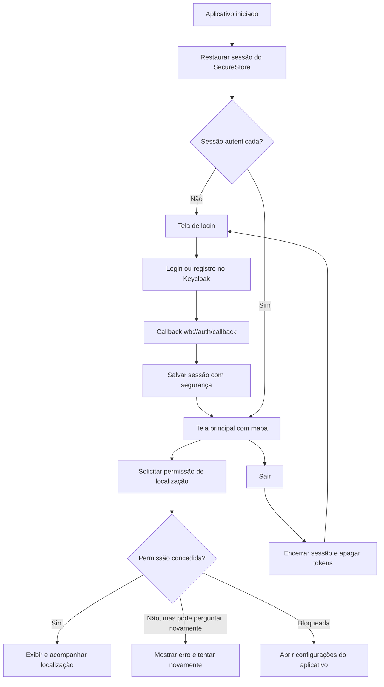
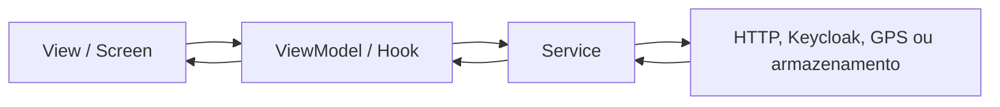

# Smart City

Aplicativo mobile para registro e acompanhamento de ocorrências urbanas. O projeto utiliza React Native com Expo, autenticação pelo Keycloak e arquitetura MVVM.

> Status: MVP mobile em desenvolvimento. Atualmente, autenticação, sessão, mapa, GPS e logout estão funcionais. A integração visual do CRUD de ocorrências ainda será implementada.

## Plataformas

- Android
- iOS
- Web não faz parte do MVP atual

O desenvolvimento e os testes realizados até agora foram concentrados no Android. A configuração para iOS existe, mas ainda precisa ser compilada e validada em macOS com Xcode.

## Funcionalidades disponíveis

- Login e registro por meio do Keycloak.
- OAuth 2.0/OpenID Connect com Authorization Code e PKCE.
- Restauração automática da sessão ao abrir o aplicativo.
- Renovação de access token com refresh token.
- Armazenamento local dos tokens com Expo SecureStore.
- Proteção de rotas: somente usuários autenticados acessam o mapa.
- Logout e possibilidade de entrar com outra conta.
- Mapa nativo no Android com Google Maps.
- Solicitação da permissão de localização em primeiro plano.
- Acompanhamento da posição do usuário com Expo Location.
- Tratamento de permissão negada ou bloqueada, incluindo atalho para as configurações do celular.
- Cliente HTTP que envia o token do Keycloak ao backend.
- Modelos, contratos, mapeamento e serviço inicial para consultar ocorrências do usuário.
- Tema claro e escuro seguindo a configuração do aparelho.

## Fluxo atual de telas



O mapa não possui acesso anônimo: enquanto não houver uma sessão válida, o Expo Router mantém o usuário no grupo de autenticação.

## Fluxo entre as camadas

O projeto segue MVVM e separa apresentação, estado da tela, regras de comunicação e dados.



- **View:** componentes e telas exibidos ao usuário.
- **ViewModel:** controla estado, carregamento, erros e ações da tela.
- **Model:** representa os dados usados pela aplicação.
- **Service:** encapsula integrações com Keycloak, API, GPS e armazenamento.
- **Composition root:** instancia as implementações e conecta suas dependências.

### Fluxo preparado para ocorrências

```text
Tela futura de ocorrências
        ↓
ViewModel futuro
        ↓
OccurrenceService
        ↓
ApiOccurrenceService
        ↓
AuthenticatedFetchHttpClient
        ↓ Authorization: Bearer <access token>
Backend /demands/my-demands
```

O serviço de consulta já está preparado, mas ainda não é chamado por uma tela. Isso significa que o backend da aplicação ainda não participa do fluxo visual atual.

## Arquitetura e estrutura

O repositório está organizado como monorepo com npm workspaces.

```text
smart-city/
├── apps/
│   └── mobile/
│       ├── app/                 # Rotas do Expo Router
│       ├── src/
│       │   ├── composition/     # Montagem das dependências
│       │   ├── config/          # Configuração da API
│       │   ├── features/
│       │   │   ├── auth/        # Autenticação e sessão
│       │   │   ├── location/    # Integração com GPS
│       │   │   ├── map/         # Tela e ViewModel do mapa
│       │   │   └── occurrences/ # Modelos e serviços de ocorrências
│       │   ├── navigation/      # Proteção e fluxo de rotas
│       │   └── shared/          # Cliente HTTP e erros compartilhados
│       ├── app.config.ts
│       └── package.json
├── packages/                    # Reservado para pacotes compartilhados
└── package.json                 # Scripts e workspaces do monorepo
```

## Tecnologias e versões principais

| Tecnologia | Versão | Uso |
|---|---:|---|
| Expo | 57.0.24 | Plataforma e ferramentas nativas |
| React | 19.2.3 | Componentes e estado |
| React Native | 0.86.3 | Aplicativo mobile |
| TypeScript | 6.0.3 | Tipagem estática |
| Expo Router | 57.0.22 | Navegação baseada em arquivos e rotas protegidas |
| Expo Auth Session | 57.0.12 | Fluxo OAuth/OIDC com PKCE |
| Expo SecureStore | 57.0.4 | Armazenamento seguro dos tokens |
| Expo Location | 57.0.19 | Permissão e acompanhamento do GPS |
| React Native Maps | 1.27.2 | Exibição do mapa nativo |
| Expo Dev Client | 57.0.19 | Build de desenvolvimento com módulos nativos |
| React Navigation | 7.x | Navegação utilizada pelo Expo Router |
| ESLint | 9.25.0 | Análise estática do código |

Também são utilizados Expo Linking, Expo Web Browser, Reanimated, Gesture Handler, Safe Area Context e React Native Screens.

## Identificação do aplicativo

| Campo | Valor |
|---|---|
| Versão | `1.0.0` |
| Scheme | `wb` |
| Android package | `com.darkartsbm.smartcitys` |
| iOS bundle identifier | `com.darkartsbm.smartcitys` |
| Callback de autenticação | `wb://auth/callback` |

## Pré-requisitos

- Node.js e npm.
- Android Studio e Android SDK para Android.
- `ANDROID_HOME` apontando para o SDK do Android.
- Emulador Android ou aparelho com depuração USB habilitada.
- JDK compatível com o Android Gradle Plugin utilizado pelo Expo.
- macOS com Xcode para compilar a versão iOS.
- Cliente público configurado no Keycloak com PKCE e callback `wb://auth/callback`.
- Maps SDK for Android habilitado no Google Cloud.
- Chave do Google Maps restrita ao pacote e ao certificado SHA-1 do build.

Este projeto usa módulos nativos. Para o fluxo completo, utilize um development build; o Expo Go não representa o ambiente final do aplicativo.

## Configuração do ambiente

Na raiz do repositório, instale as dependências:

```bash
npm install
```

Crie `apps/mobile/.env.local` com base em `apps/mobile/.env.example`:

```env
EXPO_PUBLIC_KEYCLOAK_ISSUER=https://keycloak.exemplo.com/realms/seu-realm
EXPO_PUBLIC_KEYCLOAK_CLIENT_ID=seu-client-id
GOOGLE_MAPS_ANDROID_API_KEY=Sua_chave_google_aqui
EXPO_PUBLIC_API_URL=http://SEU_HOST_LOCAL:8080
```

### Variáveis

| Variável | Finalidade |
|---|---|
| `EXPO_PUBLIC_KEYCLOAK_ISSUER` | Endereço público do realm do Keycloak |
| `EXPO_PUBLIC_KEYCLOAK_CLIENT_ID` | Identificador do cliente público mobile |
| `GOOGLE_MAPS_ANDROID_API_KEY` | Chave usada pelo Maps SDK nativo no Android |
| `EXPO_PUBLIC_API_URL` | Endereço base do backend da aplicação |

Não envie `.env.local` ao Git. Variáveis `EXPO_PUBLIC_*` e a chave utilizada pelo Maps no aplicativo não devem ser tratadas como segredos ocultos no APK. A chave do Maps deve ser protegida por restrições de aplicativo, pacote, SHA-1, API e cotas no Google Cloud.

Ao testar em um celular físico, não use `localhost` para o backend. Use o IP do computador na rede local, por exemplo `http://192.168.0.10:8080`, e mantenha celular e computador na mesma rede.

## Como executar

Todos os comandos abaixo devem ser executados na raiz do monorepo.

### Android

Compile, instale e abra o development build:

```bash
npm run mobile:android
```

Depois que o development build estiver instalado, inicie somente o Metro nas próximas execuções:

```bash
npm run mobile
```

Com o Metro aberto, pressione `a` para abrir no Android quando necessário.

### iOS

Em um Mac com Xcode:

```bash
npm run mobile:ios
```

A versão iOS ainda precisa de validação e da configuração do provedor de mapas escolhida para essa plataforma.

### Verificação do código

```bash
npm run mobile:lint
```

## Serviços externos

O fluxo atual depende de:

- **Keycloak:** autenticação, registro, tokens, renovação e logout.
- **Google Maps Platform:** mapa nativo no Android.
- **GPS do dispositivo:** localização obtida por Expo Location.
- **Backend da aplicação:** necessário para as funcionalidades de ocorrências quando forem conectadas às telas.

O APK contém apenas o frontend. Para que as ocorrências funcionem fora da rede local, o backend deverá estar publicado em uma URL HTTPS acessível pelo celular.

## O que falta para o MVP

- [ ] Criar o ViewModel da listagem de ocorrências.
- [ ] Criar a tela de listagem com `FlatList` ou `SectionList`.
- [ ] Integrar a listagem ao endpoint autenticado do backend.
- [ ] Exibir ocorrências no mapa.
- [ ] Implementar criação de ocorrência.
- [ ] Capturar foto com Expo Camera durante a criação.
- [ ] Enviar localização e dados da nova ocorrência ao backend.
- [ ] Implementar pesquisa e filtros.
- [ ] Implementar atualização de ocorrência.
- [ ] Implementar remoção de ocorrência com confirmação.
- [ ] Tratar estados vazios, carregamento e erros das telas de ocorrências.
- [ ] Refinar a tela inicial de login e a apresentação do aplicativo.
- [ ] Refinar os componentes visuais, incluindo o botão de logout.
- [ ] Validar todo o fluxo em Android físico e emulador.
- [ ] Compilar e validar o fluxo no iOS.
- [ ] Criar testes dos ViewModels e serviços principais.
- [ ] Preparar build de distribuição do MVP.
- [ ] Publicar o backend em HTTPS para testes externos.
- [ ] Revisar segredos e configurações de produção antes da publicação.

## Requisitos acadêmicos acompanhados

| Requisito | Estado |
|---|---|
| React Native com Expo para Android e iOS | Em desenvolvimento; Android validado e iOS pendente |
| Arquitetura MVVM ou MVC | MVVM adotado |
| Integração com backend | Infraestrutura preparada; telas de ocorrências pendentes |
| Navegação com Expo Router | Implementado |
| Estado com hooks nativos | Implementado |
| GPS com Expo Location | Implementado |
| Câmera com Expo Camera | Pendente |
| CRUD de ocorrências | Pendente |
| Listagem com FlatList ou SectionList | Pendente |

## Observações de segurança

- O aplicativo Keycloak é um cliente público e não possui `client_secret` no APK.
- O fluxo de login utiliza PKCE.
- Tokens são armazenados no Expo SecureStore.
- Credenciais de banco de dados pertencem exclusivamente ao backend.
- Segredos reais não devem utilizar o prefixo `EXPO_PUBLIC_`.
- A chave do Google Maps deve ser restringida no Google Cloud.
- Arquivos locais de ambiente não devem ser versionados.

## Estado atual da integração com o backend

O cliente HTTP autenticado, os modelos de ocorrência e o método `listMine` já existem. Entretanto, como ainda não há ViewModel nem tela consumindo esse serviço, o fluxo visível atual utiliza Keycloak, Google Maps, GPS e armazenamento local, mas não consulta as ocorrências no backend.
